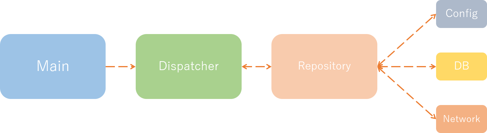

# NukkitArchitectureRFC
My idea's of nukkit plugin architecture

## SampleOAuth

[Nukkit Version](https://github.com/Ogiwara-CostlierRain464/NukkitArchitectureRFC/tree/master/SampleOAuth)
[PMMP Version](https://github.com/Ogiwara-CostlierRain464/PMMPArchitectureRFC/tree/master/SampleOAuth/src/ogiwara/oauth)

Mainly, nukkit plugin is event callback based system,  
so I've applied MVVM and Repository pattern to nukkit plugin architecture.

#### Main 
Main class of plugin, which extends PluginBase.  
Catch all events of plugin, filter it, and send to Dispatcher.  

Most plugin's event callback class is separated, and I think it makes confusing, so in this architecture, all the events are caught at here. 

#### Dispatcher
Abstracted event callback class.

#### Repository
Access config, DataBase, or NetworkAPI and offer the data to Dispatcher.

